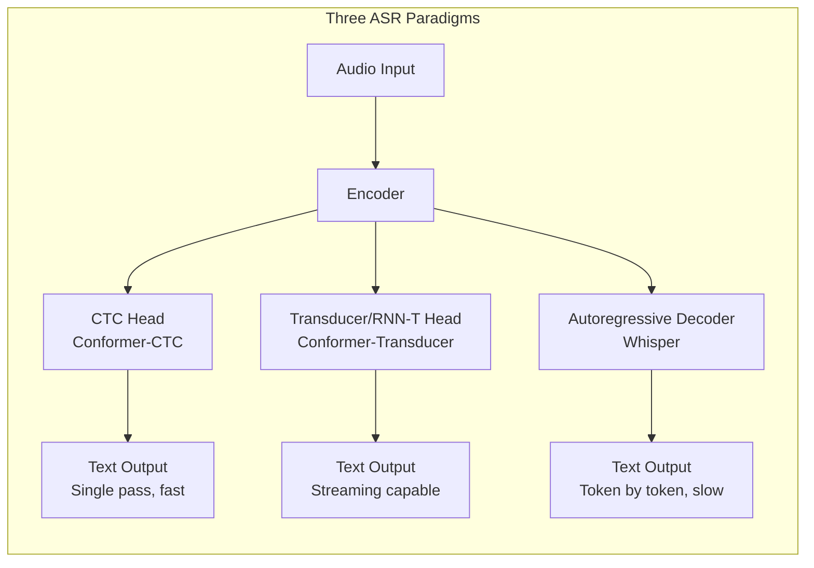
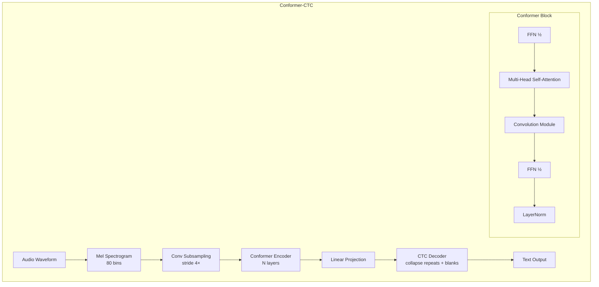
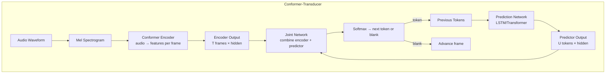
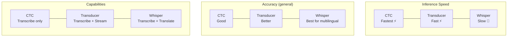
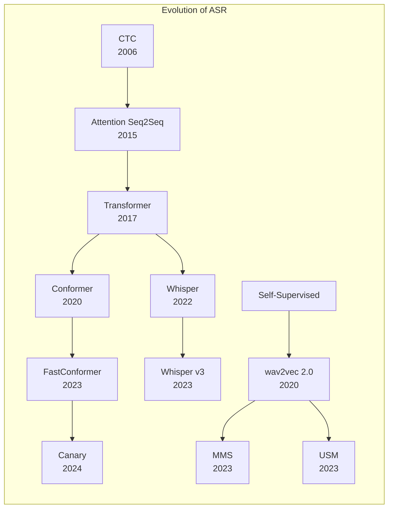
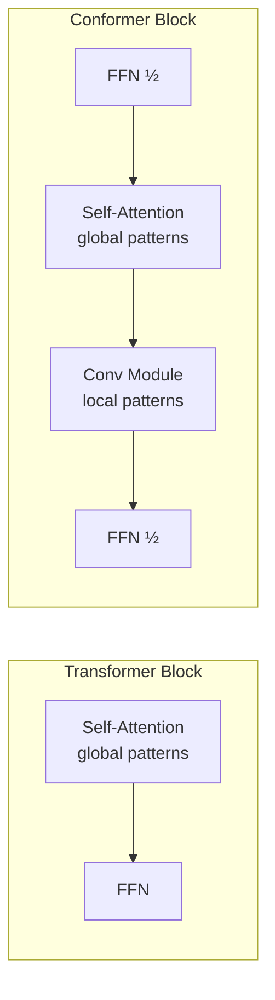
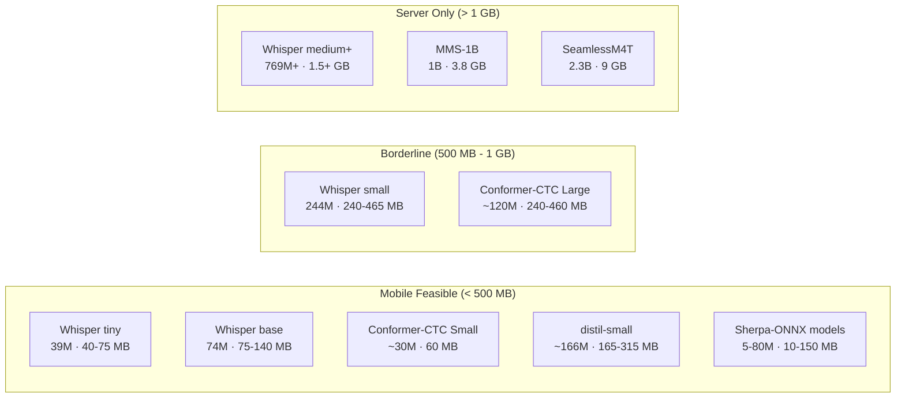
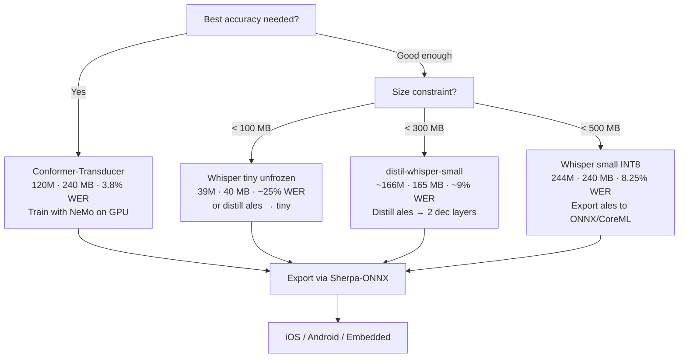

# ASR Model Architectures Comparison

## High-Level Overview

## 1. Whisper (OpenAI)

**Architecture:** Encoder-Decoder Transformer (seq2seq)

```mermaid
graph TD
    subgraph "Whisper"
        A[Audio Waveform] --> B[Mel Spectrogram<br/>80 bins × 1500 frames]
        B --> C[2× Conv1D<br/>stride 2, downsample 4×]
        C --> D[Sinusoidal Positional Encoding]
        D --> E[Transformer Encoder<br/>N layers × Self-Attention + FFN]
        E --> F[Audio Features]

        G[SOT + Language + Task] --> H[Token Embedding]
        H --> I[Learned Positional Embedding]
        I --> J[Transformer Decoder<br/>N layers × Self-Attn + Cross-Attn + FFN]
        F --> J
        J --> K[Linear + Softmax]
        K --> L[Next Token]
        L -->|autoregressive| G
    end
```

**Key properties:**
- Encoder converts audio → fixed-length features (once)
- Decoder generates text token-by-token (slow — each token requires a full decoder pass)
- Cross-attention lets decoder "look at" encoder output at each step
- 30-second input window, cannot stream
- Multilingual: language token controls output language

| Variant | Enc Layers | Dec Layers | Hidden | Params | FP32 Size | FP16 Size | INT8 Size | Mobile? |
|---------|-----------|-----------|--------|--------|-----------|-----------|-----------|---------|
| tiny    | 4         | 4         | 384    | 39M    | 150 MB    | 75 MB     | 40 MB     | Yes     |
| base    | 6         | 6         | 512    | 74M    | 280 MB    | 140 MB    | 75 MB     | Yes     |
| small   | 12        | 12        | 768    | 244M   | 930 MB    | 465 MB    | 240 MB    | Tight   |
| medium  | 24        | 24        | 1024   | 769M   | 2.9 GB    | 1.5 GB    | 750 MB    | No      |
| large-v3| 32        | 32        | 1280   | 1550M  | 5.8 GB    | 2.9 GB    | 1.5 GB    | No      |
| large-v3-turbo | 32 | 4         | 1280   | 809M   | 3.1 GB    | 1.5 GB    | 780 MB    | No      |
| distil-small* | 12  | 2         | 768    | ~166M  | 630 MB    | 315 MB    | 165 MB    | Yes     |

*distil-small is hypothetical — 2 decoder layers distilled from small.

## 2. NVIDIA Conformer-CTC

**Architecture:** Encoder-only with CTC loss

**Key properties:**
- **No decoder** — single forward pass through encoder → text
- CTC (Connectionist Temporal Classification) aligns audio frames to characters
- Conformer block = Self-Attention + Convolution (captures both global and local patterns)
- Much faster inference than Whisper (no autoregressive generation)
- Cannot do translation, only transcription

## 3. NVIDIA Conformer-Transducer (RNN-T)

**Architecture:** Encoder + Prediction Network + Joint Network

**Key properties:**
- **Streaming capable** — processes audio frame by frame
- Joint network combines audio context + text context at each step
- Prediction network is like a lightweight decoder (usually LSTM)
- Better than CTC for accuracy (models token dependencies)
- Faster than Whisper (prediction network is lightweight)
- NVIDIA's best: **3.8% WER** on Belarusian

## Architecture Comparison

| Feature | Whisper | Conformer-CTC | Conformer-Transducer |
|---------|---------|---------------|---------------------|
| **Inference** | Slow (autoregressive) | Fastest (single pass) | Fast (frame-by-frame) |
| **Streaming** | No (30s chunks) | Yes | Yes |
| **Translation** | Yes | No | No |
| **Multilingual** | 99 languages | Per-language models | Per-language models |
| **Training data** | 680k hours (weak labels) | Clean labeled data | Clean labeled data |
| **Best BE WER** | 6.79% (fine-tuned small) | 4.8% (NVIDIA large) | 3.8% (NVIDIA large) |

## 4. Other SOTA Architectures

### Meta MMS (Massively Multilingual Speech)
- Based on **wav2vec 2.0** — self-supervised encoder + CTC
- Pre-trained on 500k hours unlabeled audio across 1,400+ languages
- Fine-tuned with CTC on labeled data
- 1B parameters

### Meta SeamlessM4T v2
- **Encoder-Decoder** like Whisper but with shared multilingual representations
- Supports speech-to-text, text-to-speech, speech-to-speech translation
- Trained with self-supervised + supervised objectives

### Google USM (Universal Speech Model)
- 2B parameter encoder trained on 12M hours of audio (300+ languages)
- Uses **BEST-RQ** self-supervised pre-training
- Fine-tuned with CTC or attention decoder
- Not publicly available

### Canary (NVIDIA, 2024)
- Multi-task: ASR + Translation in one model
- Conformer encoder + Transformer decoder (hybrid)
- FastConformer variant with 8× downsampling (vs 4× standard)
- 1B parameters, supports 4 languages

## Why the Conformer Block Works

The key innovation of Conformer over plain Transformer:

- **Self-Attention** captures long-range dependencies (e.g., context from the whole utterance)
- **Convolution** captures local patterns (e.g., phoneme boundaries, acoustic features)
- Combining both in one block gives the best of both worlds
- This is why Conformer-based models (NVIDIA) beat pure Transformer models (Whisper) on per-language accuracy

## Mobile Deployment Guide

### Device constraints
- **iPhone** (Neural Engine): ~2 GB model RAM budget, Core ML format, INT8 preferred
- **Android** (GPU/NNAPI): ~1.5 GB model RAM budget, ONNX/TFLite format
- **Edge devices** (RPi, embedded): <500 MB, INT8 or smaller required

### What fits on a phone

### Model size vs accuracy for Belarusian

| Model | Params | INT8 Size | WER (BE) | RTF* | Mobile? |
|-------|--------|-----------|----------|------|---------|
| Whisper tiny (fine-tuned, frozen enc) | 39M | 40 MB | ~57% | 0.1x | Yes |
| Whisper tiny (fine-tuned, full) | 39M | 40 MB | ~20-30%** | 0.1x | Yes |
| Whisper base (fine-tuned) | 74M | 75 MB | ~15-20%** | 0.15x | Yes |
| Conformer-CTC Small | ~30M | 60 MB | ~8-12%** | 0.05x | Yes, fast |
| **Whisper small (ales fine-tuned)** | 244M | 240 MB | **8.25%** | 0.3x | Tight |
| distil-whisper-small (2 dec layers) | ~166M | 165 MB | ~9-10%** | 0.15x | Yes |
| Conformer-Transducer Large (NVIDIA) | ~120M | 240 MB | **3.8%** | 0.08x | Yes, fast |
| Whisper large-v3 | 1550M | 1.5 GB | ~5-8%** | 2.0x | No |

*RTF = Real-Time Factor (lower = faster, <1.0 means faster than real-time)
**Estimated, not measured

### Export formats for mobile

| Platform | Format | Tool | Quantization |
|----------|--------|------|-------------|
| iOS | Core ML (.mlpackage) | `coremltools` | INT8, FP16 |
| Android | ONNX (.onnx) | `optimum` / `onnxruntime` | INT8, FP16 |
| Cross-platform | ONNX | `onnxruntime-mobile` | INT8 |
| Cross-platform | Sherpa-ONNX | `sherpa-onnx` | INT8, pre-packaged |

### Sherpa-ONNX — fastest path to mobile

[Sherpa-ONNX](https://github.com/k2-fsa/sherpa-onnx) is an open-source toolkit specifically designed for on-device ASR:
- Pre-built iOS/Android/embedded SDKs
- Supports Whisper, Conformer-CTC, Transducer, Zipformer models
- Streaming and non-streaming modes
- INT8 quantization built in
- C/C++/Python/Swift/Kotlin/Java APIs
- Models as small as 5 MB (for English; Belarusian would need fine-tuning)

### Recommended mobile strategy for Belarusian

**Best bang for buck:** Export our ales fine-tuned whisper-small to ONNX INT8 (240 MB). Fits on any modern phone, 8.25% WER, and we already have the model.

## Implications for Belarusian ASR

To reach **<4% WER**:
1. **Conformer-Transducer** architecture is proven best for single-language ASR
2. NVIDIA already achieved 3.8% with CV10 data — CV24 has 3× more data
3. Fine-tuning Whisper large-v3 on Belarusian could also compete (more params, but slower inference)
4. The encoder matters most — unfreezing it during fine-tuning is critical for adaptation

To deploy **on mobile**:
1. **Quickest:** Export ales whisper-small to ONNX INT8 (240 MB, 8.25% WER)
2. **Smallest:** Distill ales → whisper-tiny (40 MB, ~20-25% WER estimated)
3. **Best quality + mobile:** Train Conformer-Transducer small with NeMo (~60 MB, ~5-8% WER estimated)
4. **Best tooling:** Use Sherpa-ONNX for cross-platform deployment
